# Диаграммы последовательностей (Mermaid)

## Ф1. Задать интересы свободным текстом

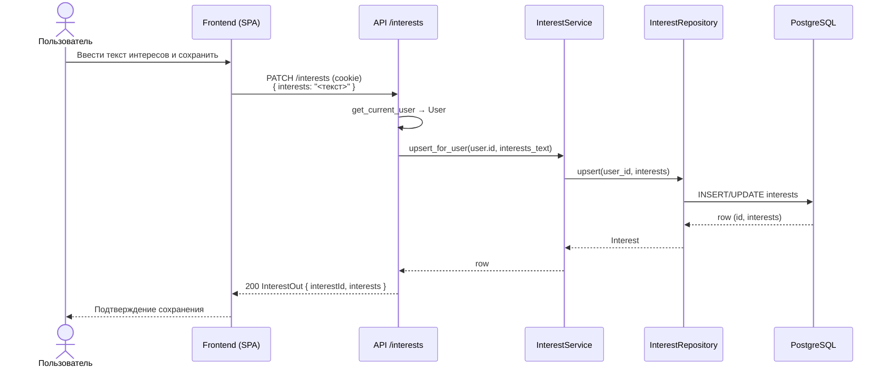

---

## Ф2. Изменить ранее заданные интересы

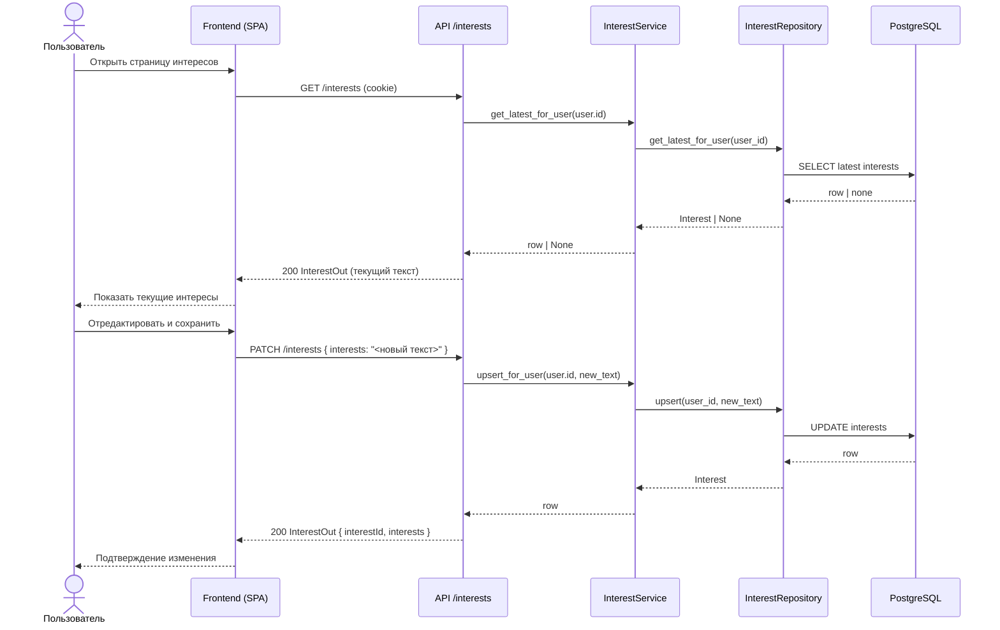

---

## Ф3. Отобразить персональную ленту сводок

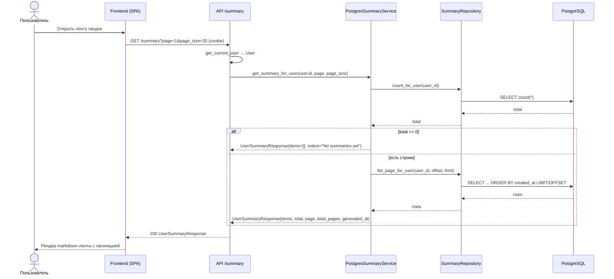

---

## Ф4. Открыть исходные материалы, связанные со сводкой

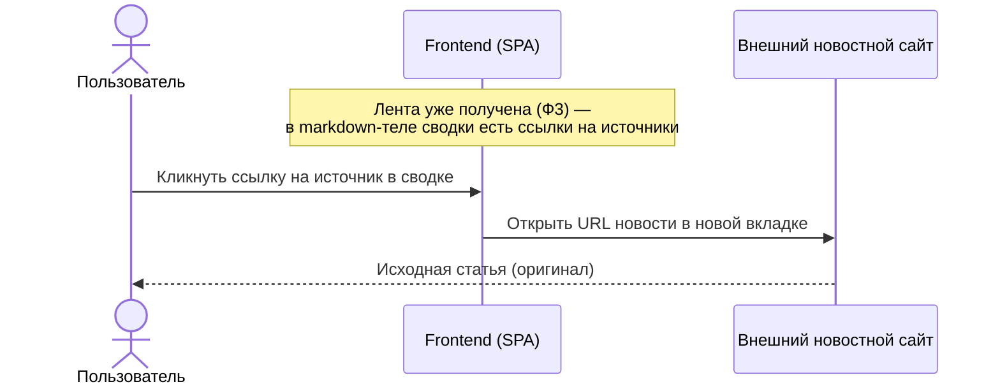

---

## Ф5. Учитывать оценки при последующей подготовке материалов

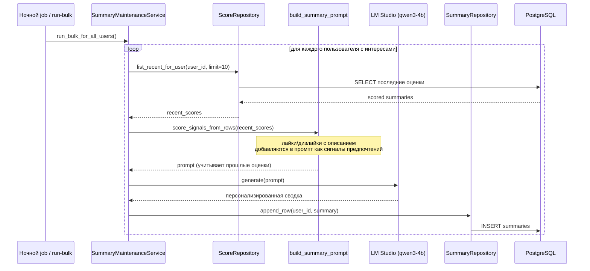

---

## Ф6. Принять пользовательскую оценку сводки

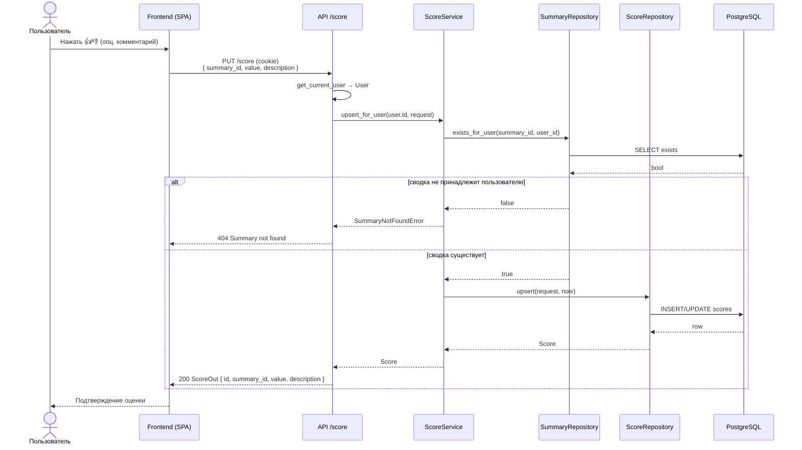

---

## Ф7. Доставить подготовленные сводки по выбранному каналу (Telegram)

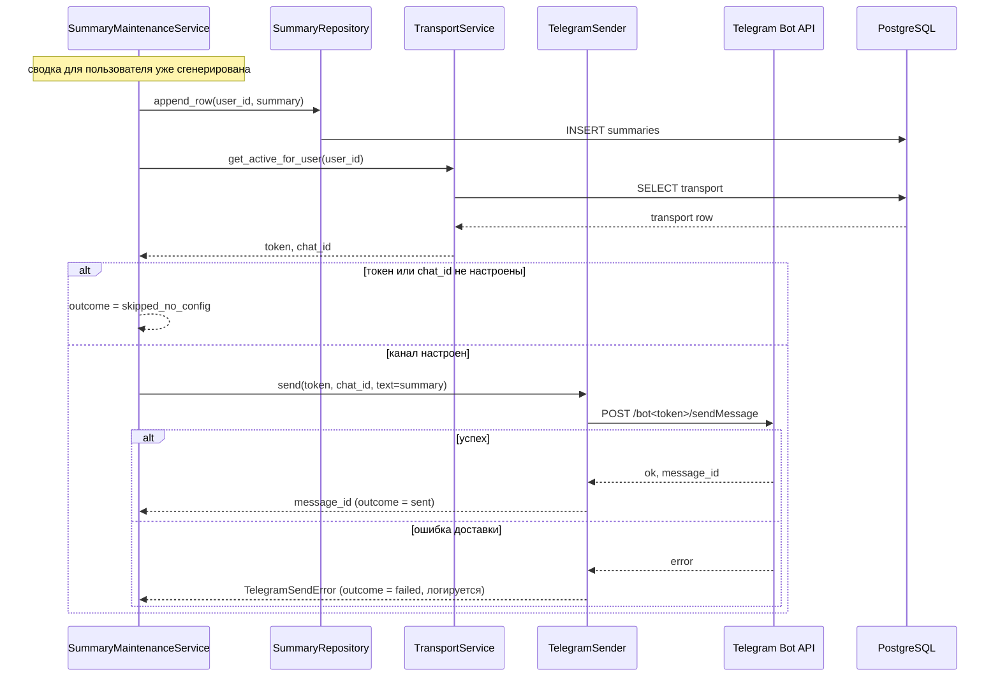

---

## Ф8. Экспортировать историю сводок в CSV

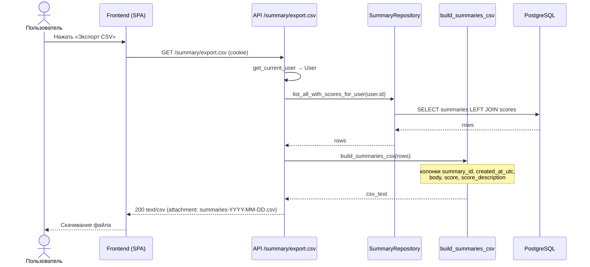

---

## Ф9. Получать новости из активных источников

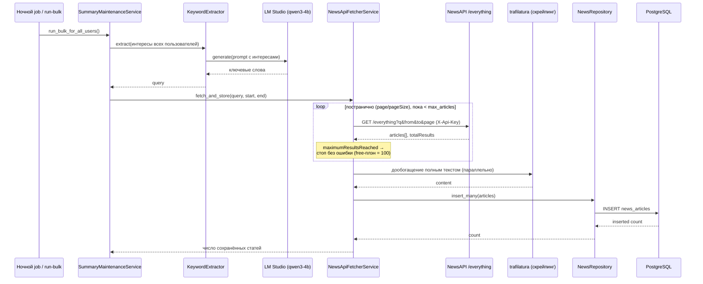

---

## Ф10. Сохранять исходные новости с метаданными

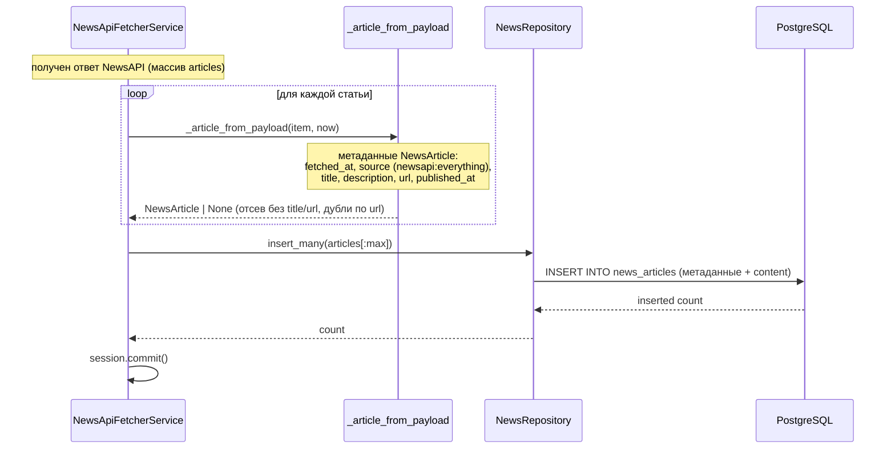

---

## Ф11. Импортировать историю сводок из CSV

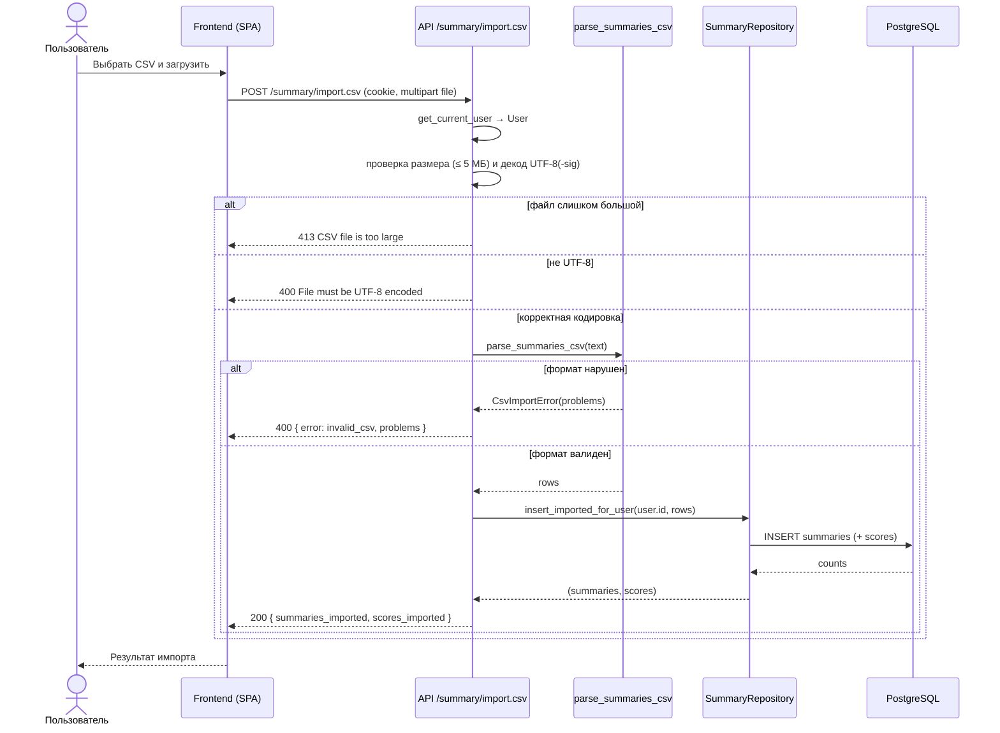

---

## Ф12. Отчёт о количестве сгенерированных сводок (за всё время и за сегодня)

Глобальные счётчики по всем пользователям; endpoint'ы без авторизации.

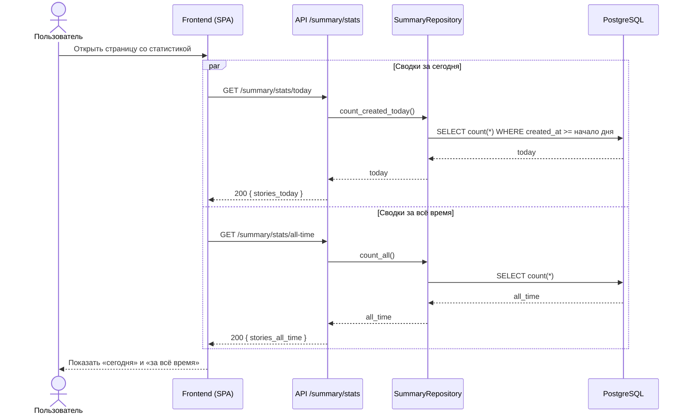
